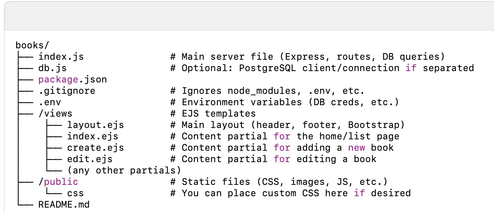

# Books CRUD Project


A simple Node.js application for managing your reading list with Create, Read, Update, and Delete (CRUD) operations. Uses PostgreSQL for data storage, EJS for server-side rendering, and Bootstrap for styling. Integrates with the Open Library Covers API to display book covers by ISBN.

Features
	•	CRUD: Add new books, view a list of books, update existing books, and delete entries.
	•	PostgreSQL: Stores all book data (title, author, ISBN, rating, review, etc.).
	•	Open Library Covers: Fetches covers by ISBN using the API.
	•	Sorting: Sort your book list by rating, date read, or default creation date.
	•	Bootstrap: Provides a modern, responsive design.
	•	Environment Variables: Manage DB credentials securely via .env.

  Table of Contents
	1.	Requirements
	2.	Installation
	3.	Configuration
	4.	Database Setup
	5.	Usage
	6.	Project Structure
	7.	Routes Overview

## Table of Contents
- [Requirements](#requirements)
- [Installation](#installation)
- [Configuration](#configuration)
- [Database Setup](#database-setup)
- [Usage](#usage)
- [Project Structure](#project-structure)
- [Routes Overview](#routes-overview)

##  Requirements
•	Node.js (v14+ recommended)
•	PostgreSQL (v12+ recommended)

## Installation
1.	Clone the repository:

```
git clone https://github.com/yourusername/books-project.git
cd books-project
```
2. 	Install dependencies:
```
npm install
```
3.	3.	Set up environment variables:
See Configuration below.

4.	Run the server:
```
npm run dev
```
or
```
npm start
```
(depending on the scripts in package.json)

## Configuration

Create a .env file in the root directory:
```
DB_USER=postgres
DB_PASS=your_password
DB_NAME=books_db
DB_HOST=localhost
DB_PORT=5432
```
Add any additional environment variables here (e.g., PORT=3000 if you want to override the default). Never commit your .env file to version control.

## Database Setup
1.	Create the database (using psql or a GUI):
```
CREATE DATABASE books_db;
```
2.	Create the books table:
```
CREATE TABLE books (
    id SERIAL PRIMARY KEY,
    title VARCHAR(255) NOT NULL,
    author VARCHAR(255),
    isbn VARCHAR(20),
    rating INT,
    review TEXT,
    date_read DATE,
    created_at TIMESTAMP DEFAULT NOW(),
    updated_at TIMESTAMP DEFAULT NOW()
);
```
3.	Confirm your credentials in .env match the DB you just created.

## Usage
1.	Run the app:
 ```
 npm run dev
 ```
 This starts the server on http://localhost:3000.

2.	View the main page:
	•	Go to http://localhost:3000 to see your book list.
	•	Use the Add Book button to create a new entry.

3.	Sort Books:
	•	Add ?sort=rating to sort by rating: e.g., http://localhost:3000/?sort=rating.
	•	Add ?sort=date to sort by date read.
  
4.	Edit or Delete:
	•	Click Edit to update a book’s details.
	•	Click Delete to remove a book from the list.

## Project Structure
1. his starts the server on http://localhost:3000.
2.	View the main page:
 •	Go to http://localhost:3000 to see your book list.
 •	Use the Add Book button to create a new entry.
3.	Sort Books:
 •	Add ?sort=rating to sort by rating: e.g., http://localhost:3000/?sort=rating.
 •	Add ?sort=date to sort by date read.
4.	Edit or Delete:
 •	Click Edit to update a book’s details.
 •	Click Delete to remove a book from the list.

Project Structure

## Routes Overview

GET /
	•	Purpose: Display all books.
	•	Query Params: ?sort=rating or ?sort=date to order results.
	•	Renders: views/index.ejs, wrapped in layout.ejs.

GET /books/new
	•	Purpose: Show the form to add a new book.
	•	Renders: views/create.ejs (in layout.ejs).

POST /books
	•	Purpose: Insert a new book into the database.
	•	Body: { title, author, isbn, rating, review, date_read }.
	•	Redirects to /.

GET /books/:id/edit
	•	Purpose: Show the form to edit an existing book.
	•	Renders: views/edit.ejs with the existing book data.

POST /books/:id
	•	Purpose: Update an existing book’s info in the database.
	•	Body: Updated fields (same shape as POST /books).

POST /books/:id/delete
	•	Purpose: Delete a book by its ID.
	•	Redirects to /.

GET /cover/:isbn (Optional API integration example)
	•	Purpose: Demonstrate calling the Open Library Covers API to check if a cover exists.
	•	Response: JSON containing the URL for the cover or an error.

Enjoy logging your books with Node.js, PostgreSQL, EJS, and Bootstrap! If you encounter any issues, please open a ticket or submit a pull request.
